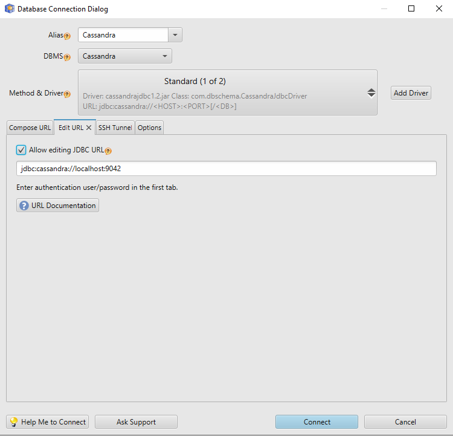
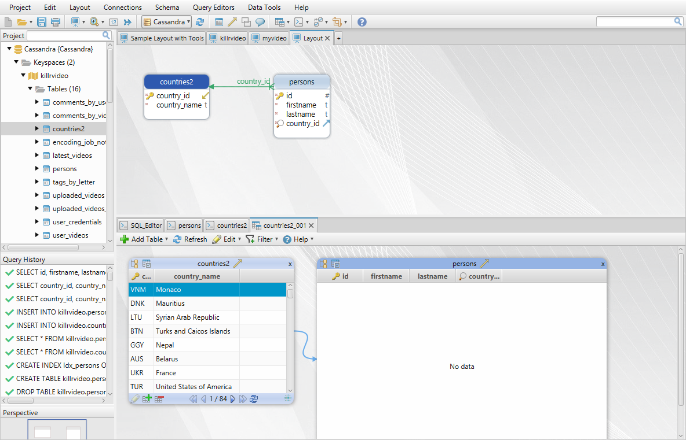
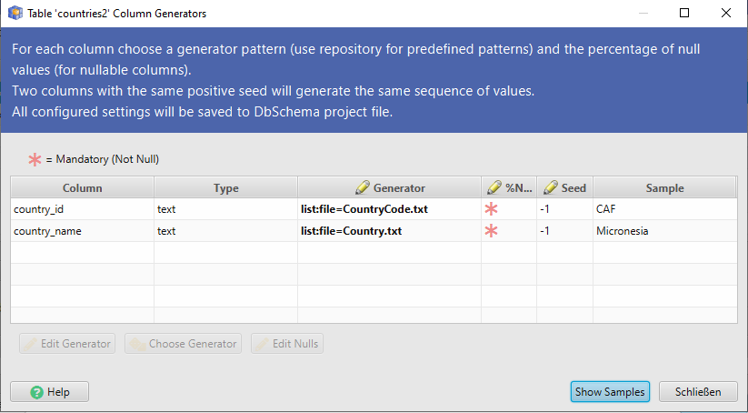

# Cassandra JDBC Driver | DbSchema Cassandra Designer

This is an open source JDBC Driver for Cassandra.
The driver is provided and used by [DbSchema Cassandra GUI Tool](https://dbschema.com).
The code is using few improvements done to the original code by DataGrip.

## Licensing

[GPL-3 dual license](https://opensource.org/licenses/GPL-3.0).
The driver is free to use by everyone.
Code modifications allowed only to the current repository as pull requests
https://github.com/wise-coders/cassandra-jdbc-driver

## Features

* Connect to Cassandra using the same JDBC URL as the native Cassandra Java driver
* Execute native Cql queries
* Implement of DatabaseMetaData methods for getting table, columns and index structure

## Downloading the Driver Binaries

[Available here](https://dbschema.com/jdbc-drivers/CassandraJdbcDriver.zip). Unpack and include all jars in your classpath. 

## How to Configure the JDBC Driver

* Java Driver Class: CassandraJdbcDriver
* JDBC URL: jdbc:cassandra://host1[:port1][,host2[:port2],...[,hostN[:portN]]][/[keyspace][?options]]
* Website: [DbSchema](https://dbschema.com/cassandra-designer-tool.html)

Make sure your password don't have any ampersand character (<code>&</code>), since it is part of the parameters' delimiter.
If it is not possible, set your password by using a Properties object.

The driver we wrote on top of the native [Cassandra Java Driver](https://github.com/datastax/java-driver)

### Using a File to Configure Your Driver

You can configure your driver using a file by passing using the `configfile` parameter and the path to file, like this:

`configfile=/path/to/file.conf`

Please, refer to [DataStax Driver Configuration Reference](https://docs.datastax.com/en/developer/java-driver/4.14/manual/core/configuration/reference/) to know all possible parameters.

## Connecting using SSL

For this set this URL parameters:

`javax.net.ssl.trustStore=/path/to/client.truststore&javax.net.ssl.trustStorePassword=password123&amp;`

If you're using client authentication:

`javax.net.ssl.keyStore=/path/to/client.keystore&javax.net.ssl.keyStorePassword=password123`

This parameters can be also set in DbSchema.vmoptions file like :

`-Djavax.net.ssl.trustStore=/path/to/client.truststore`

`-Djavax.net.ssl.trustStorePassword=password123`

If you're using client authentication:

`-Djavax.net.ssl.keyStore=/path/to/client.keystore`

`-Djavax.net.ssl.keyStorePassword=password123`

## Retrieving your Password from an AWS Secrets Entry

You can to retrieve your password from AWS Secrets by passing these parameters:

* `awsregion`: The region which your secret was stored in;

* `awssecretname`: The name of the secret were is your password stored in.

To authenticate in AWS, the driver uses the DefaultCredentialsProviderChain. To know
more about it, refer to [AWS DefaultCredentialsProvider documentation](https://docs.aws.amazon.com/sdk-for-java/v1/developer-guide/credentials.html).

## Connecting to AWS Keyspaces

You can connect to AWS Keyspaces by using this JDBC URI example:

`jdbc:cassandra://<aws_keyspaces_endpoint>:9142/<default_keyspaces>?dc=<aws_region>&javax.net.ssl.trustStore=/path/to/client.truststore&javax.net.ssl.trustStorePassword=password123`

Click here to know more about [AWS Keyspaces Service Endpoints](javax.net.ssl.trustStore=/path/to/client.truststore&javax.net.ssl.trustStorePassword=password123).

## How to Test the Driver

The driver can be tested by simply by [downloading DbSchema](https://dbschema.com). 
The tool can be evaluated 15 days for free.

DbSchema already include the Cassandra JDBC driver. You can simply connect to Cassandra and reverse engineer the schema.

Using the second tab you can enter a custom URL.

DbSchema can reverse engineer the schema and represent it as diagrams.

The Query Editor can be used for executing Cql Queries:

DbSchema can create virtual foreign keys, which are saved to project file.
They can be used in Relational Data Browse, to simply explore data from multiple tables.

Also a random data generator for Cassandra is available:

